# checkma♗e

Supercharge your test automation with AI. Write steps in plain English. No locators or tedious maintenance required. Checkmate combines Gemini's intelligence with Playwright's ecosystem for smarter, more resilient execution.

### How It Works
You write natural language:
```javascript
await ai.run({
    action: `Type 'playwright test automation' in the search bar and press Enter`,
    expect: `Search results contain the playwright.dev link`
})
```
Instead of chaining locators, methods and assertions:
```javascript
await page.locator('#search-input').fill('playwright test automation')
await page.press('#search-input', 'Enter')
await expect(page.getByRole('link', { name: '#search-result' })
    .filter({ hasText: 'playwright.dev' }).first())
    .toBeVisible()
```

### Features
- **Write tests in plain English** – no locators needed
- **Web & Salesforce support** – out of the box
- **Resilient** – tests adapt automatically to UI changes
- **Cost saving** – tracks token use, filters chat history, compresses screenshots 
- **Reporting** – console logs, HTML and JUnit output

## 🚀 Quick Start
### Prerequisites

- Node.js 18+
- Google [Gemini API](https://aistudio.google.com/app/apikey) key
- (optional) [Salesforce CLI](https://developer.salesforce.com/tools/salesforcecli) for Salesforce testing

### Installation

```bash
# Clone the repository
git clone https://github.com/dawiddiwad/checkmate.git
cd checkmate

# Install dependencies
npm install

# Copy environment template and configure
cp .env.example .env
# Edit .env with your API key
```

### Configuration

Create a `.env` file based on `.env.example` (comprehensive configuration reference):

```bash
# Required - Get your key at: https://aistudio.google.com/app/apikey
GOOGLE_API_KEY=your_gemini_api_key_here

# Gemini model configuration
GOOGLE_API_MODEL=gemini-2.5-flash #if overloaded use gemini-2.5-flash-preview-09-2025 
GOOGLE_API_TEMPERATURE=0

# Playwright settings
PLAYWRIGHT_MCP_BROWSER=chromium
PLAYWRIGHT_MCP_HEADLESS=false
PLAYWRIGHT_MCP_OUTPUT_DIR=./test-results
```

### Running Tests

```bash
# Run web application tests
npm run test:web

# Run Salesforce tests (requires SF CLI authentication)
npm run test:salesforce

# Run experimental live API tests (streaming AI)
npm run test:live

# View HTML report
npx playwright show-report test-reports/html

# View Playwright traces
npx playwright show-trace test-results/traces/trace.zip
```

## Writing Tests

Tests are written using natural language specifications with `action` and `expect` fields:

```typescript
import { test } from "../../fixtures/checkmate"

test('search for playwright documentation', async ({ ai }) => {
    await test.step('Navigate to Google', async () => {
        await ai.run({
            action: `Open the browser and navigate to google.com`,
            expect: `google.com is loaded and the search bar is visible`
        })
    })
    
    await test.step('Search for Playwright', async () => {
        await ai.run({
            action: `Type 'playwright test automation' in the search bar and press Enter`,
            expect: `Search results contain the playwright.dev link`
        })
    })
})
```

### Best Practices

1. **Be Specific** - Clear expectations help the AI validate success
2. **One Action Per Step** - Break complex flows into discrete steps
3. **Include Context** - Mention relevant UI elements and expected behavior
4. **Add Timing Hints** - For slow operations, mention expected wait times
5. **Handle Popups** - Explicitly mention consent dialogs or modals

### Example: Complex Interaction

```typescript
await test.step('Fill form and submit', async () => {
    await ai.run({
        action: `
            Wait for the newsletter popup (takes ~30 seconds), 
            then close it by clicking the X button.
            Scroll to the comment section and click to activate it.
            Type 'Great article!' into the comment textarea.
            Click the Submit button.
        `,
        expect: `
            The comment is submitted, 
            and either a success message appears 
            or a login form is displayed if not authenticated.
        `
    })
})
```
## 🛠️ Configuration Options

### Gemini API Settings

| Variable | Default | Description |
|----------|---------|-------------|
| `GOOGLE_API_KEY` | - | **Required** - Your Gemini API key |
| `GOOGLE_API_MODEL` | `gemini-2.5-flash` | Model: gemini-2.5-flash, gemini-flash-latest, gemini-2.5-flash-preview-09-2025, gemini-2.5-pro  (recommended: gemini-2.5-flash-preview-09-2025) |
| `GOOGLE_API_TEMPERATURE` | `0` | Creativity (0=deterministic, 1=creative) |
| `GOOGLE_API_TIMEOUT_SECONDS` | `10` | API request timeout in seconds |

### Gemini Live API Settings (Experimental)

| Variable | Default | Description |
|----------|---------|-------------|
| `GEMINI_RETRY_MAX_ATTEMPTS` | `3` | Max retry attempts for failed requests |

### Playwright MCP Settings

| Variable | Default | Description |
|----------|---------|-------------|
| `PLAYWRIGHT_MCP_VERSION` | `latest` | MCP package version (eg: 0.4.5) |
| `PLAYWRIGHT_MCP_BROWSER` | `chromium` | Browser: chromium, firefox, webkit |
| `PLAYWRIGHT_MCP_HEADLESS` | `false` | Run browser in headless mode |
| `PLAYWRIGHT_MCP_OUTPUT_DIR` | `./test-results` | Screenshots and traces location |
| `PLAYWRIGHT_MCP_SAVE_VIDEO_SIZE` | - | Record video: WxH format (eg: 1280x720) |
| `PLAYWRIGHT_MCP_ISOLATED` | `false` | Use isolated browser contexts |
| `PLAYWRIGHT_MCP_CAPS` | - | Custom browser capabilities (JSON) |

## 💰 Cost Management

Checkmate includes built-in token usage monitoring:

```
| input tokens usage
| response: 2543 @ $0.0019$
| history: 45234
| cached: 12000
| step: 5123 @ $0.0038$
| test: 25678 @ $0.0192$
```

### Cost Optimization Features

1. **Screenshot Compression** - Images normalized to 768x768 tiles before sending (258 tokens each)
2. **History Filtering** - Removes snapshot responses from chat history
3. **Chat Recycling** - New session per step to prevent context bloat
4. **Token Counting** - Real-time usage tracking per step and test

### Estimated Costs (Gemini 2.5 Flash)

- Simple web test (5 steps): ~$0.01 - $0.05
- Complex Salesforce flow (20 steps): ~$0.10 - $0.30
- Full test suite (50 tests): ~$5.00 - $15.00

*Costs vary based on model, screenshot size and count, and page complexity*

## Salesforce Testing

Checkmate includes native Salesforce support using the SF CLI:

### Prerequisites

```bash
# Install Salesforce CLI
npm install -g @salesforce/cli

# Authenticate to your org
sf org login web --alias my-org

# Set as default
sf config set target-org my-org
```

### Example Salesforce Test

```typescript
test('create and configure itinerary', async ({ ai }) => {
    await test.step('Login to Salesforce', async () => {
        await ai.run({
            action: `Login to Salesforce and open Test QA Application`,
            expect: `Test QA homepage is displayed`
        })
    })
    
    await test.step('Create new itinerary', async () => {
        await ai.run({
            action: `
                Click 'New', select 'Quote' record type, 
                fill 'Itinerary Name' = 'AI Test', 
                'Account' = 'Test Account', 
                'Group Size' = '5', 
                then Save
            `,
            expect: `New itinerary is saved and details page is displayed`
        })
    })
})
```

The `get_salesforce_login_url` tool automatically generates a front-door URL for authentication.

## Test Reports

Multiple report formats are generated after each run:

- **HTML Report**: `test-reports/html/index.html` (interactive - no screenshots/video yet though)
- **JUnit XML**: `test-reports/junit/results.xml` (CI/CD integration)
- **Console Output**: Real-time step results and token usage

```bash
# Open HTML report in browser
npx playwright show-report test-reports/html
```

### Common Issues

**Test hangs at step execution**
- Check if the page loaded correctly (look for navigation errors)
- Verify API key is valid and has quota
- Increase timeout in `playwright.config.ts`

**AI makes wrong decisions**
- Add more context in the `action` description
- Mention specific element identifiers (text, labels)
- Use step-by-step approach instead of complex multi-action steps

**High token costs**
- Use more specific selectors in descriptions
- Consider caching (see Roadmap)

## Project Structure

```
checkmate-exp/
├── src/
│   ├── mcp/                                     # MCP server integrations
│   │   ├── server/                              # MCP server implementations
│   │   │   ├── gemini-mcp.ts                    # Base MCP client wrapper
│   │   │   └── playwright-mcp.ts                # Playwright MCP config
│   │   └── tool/                                # MCP tool interfaces
│   │       ├── gemini-tool.ts                   # Tool interface
│   │       └── playwright-tool.ts               # Playwright tool wrapper
│   ├── salesforce/                              # Salesforce integrations
│   │   ├── salesforce-cli-authenticator.ts
│   │   ├── salesforce-cli-handler.ts
│   │   └── salesforce-tool.ts
│   └── step/                                    # Core execution engine
│       ├── configuration-manager.ts             # Centralized config
│       ├── experimental/                        # Experimental features
│       │   └── gemini-live-session-manager.ts
│       ├── gemini/                              # Gemini AI integrations
│       │   ├── gemini-client.ts                 # Enhanced Gemini API client
│       │   ├── gemini-session-manager.ts        # Main orchestrator
│       │   ├── gemini-token-pricing.ts          # Cost tracking
│       │   ├── history-manager.ts               # Chat history management
│       │   ├── prompts.ts                       # Prompt templates
│       │   ├── response-processor.ts            # Response processing
│       │   └── token-tracker.ts                 # Token usage tracking
│       ├── tool/                                # Tool management
│       │   ├── screenshot-processor.ts          # Screenshot optimization
│       │   ├── step-tool.ts                     # Pass/fail tools
│       │   └── tool-registry.ts                 # Tool management
│       └── types.ts                             # Type definitions
├── test/
│   ├── fixtures/
│   │   ├── checkmate.ts                         # Standard Playwright fixtures
│   │   └── checkmate-live.ts                    # Live API fixtures
│   └── specs/
│       ├── live/                                # Experimental live API tests
│       ├── web/                                 # Web application tests
│       └── salesforce/                          # Salesforce tests
├── test-reports/                                # Generated reports
├── test-results/                                # Screenshots, videos, traces
├── playwright.config.ts                         # Test runner configuration
├── .env.example                                 # Comprehensive configuration
└── package.json
```

### Architecture:
The framework combines:
- **Gemini AI** for understanding and decision-making (both chat and live APIs)
- **Playwright Test** for managing test runs, fixtures and reporting
- **Playwright MCP** (Model Context Protocol) for browser automation
- **Salesforce CLI** for Salesforce-specific operations
- **Modular Components**: Configuration management, response processing, token tracking, history filtering, screenshot compression
- **Experimental Live API**: Real-time AI interactions with streaming responses



### 🌊 Flow


## 🤝 Contributing

This is an experimental project exploring the future of test automation. Contributions, ideas, and feedback are welcome!

### Development Setup

```bash
npm install
npm run test:web
```

### Key Areas for Contribution

- [ ] Additional tool integrations (API testing, mobile apps)
- [ ] Improved error handling and retry logic
- [ ] Cost optimization strategies
- [ ] Better prompt engineering
- [ ] Performance benchmarks

## 📜 License

MIT License - see LICENSE file for details

## 📚 Learn More

- [Playwright MCP](https://github.com/microsoft/playwright/tree/main/utils/mcp-server)
- [Playwright Documentation](https://playwright.dev/)
- [Gemini API](https://ai.google.dev/)
- [Gemini Function Calling](https://ai.google.dev/docs/function_calling)
- [Model Context Protocol](https://modelcontextprotocol.io/introduction)

---

**Experimental Project Notice**

Checkmate is an experimental framework exploring AI-driven test automation. While functional, it's not yet recommended for production CI/CD pipelines. Expect:
- Non-deterministic behavior
- Higher costs than traditional automation
- Occasional AI misinterpretation of UI elements

Use for exploratory testing, rapid prototyping, and demonstrating AI capabilities in testing.

---

### Current Status:

- **Version 0.0.1**
- Enhanced architecture with modular components and retry logic
- Support for both traditional chat API and experimental live API
- Comprehensive configuration management and cost optimization
- Working examples for web testing, Salesforce testing, and live session testing
- Not yet recommended for production CI/CD pipelines due to non-deterministic behavior

### Future Vision:

The roadmap shows ambitious plans for caching, RAG-based element retrieval, open-ai api support, visual testing, and eventually becoming a production-ready enterprise testing platform.

This is a cutting-edge exploration of how AI can revolutionize test automation by making it more human-like and maintainable! 🚀

---
Built with ❤️ by Dawid Dobrowolski @ SoftQA