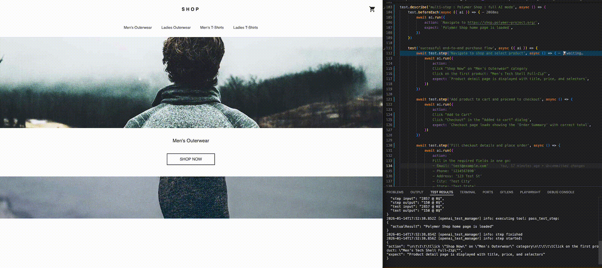

# **_checkmate_**

AI test automation that actually works. Write tests in plain English, without locators, and with less code.


[](LICENSE)

##

Spending countless hours building and maintaining E2E tests?

Try **_checkmate_**!

```typescript
await ai.run({
	action: `
		Navigate to google.com
		Type 'playwright test automation' in the search bar
		Press Enter key`,
	expect: `
		Search results contain the playwright.dev link`,
})
```

##

✅ **Zero Locators** - Write tests in plain English  
✅ **Any Provider** - Gemini, Claude, Groq, GPT, xAI, or local models  
✅ **Web & Salesforce** - Basic support out of the box  
✅ **Cost Optimized** - Built-in token management and budgeting  
✅ **Playwright Test** - Native reports, traces and debugging  
✅ **Fully Customizable** - Build your own [extensions](docs/EXTENSIONS.md) and tools



## Get Started in 5 Minutes

### Prerequisites

- Node.js [LTS](https://nodejs.org/en/download)
- OpenAI [API key](https://platform.openai.com/api-keys) or compatible provider [Groq](https://console.groq.com/keys) [Gemini](https://aistudio.google.com/app/api-keys) [xAI](https://x.ai/api) etc.

### 1. Install

```bash
npm install -D dotenv @playwright/test @xoxoai/checkmate
npx playwright install
```

### 2. Configure `.env`

_using [OpenAI API](https://platform.openai.com/settings/organization/api-keys) key and default settings:_

```bash
OPENAI_API_KEY=#your_api_key_here
```

_for other providers, set the base url and model:_

```bash
OPENAI_BASE_URL=https://api.groq.com/openai/v1
OPENAI_MODEL=openai/gpt-oss-20b
```

### 3. Scaffold Test Examples

```bash
npx checkmate create-examples
```

### 4. Run Tests

```bash
npm run test:web:example
```

### 5. View Report

```bash
npm run show:report
```

## Writing Tests

**_checkmate_** tests are written using natural language by specifying `action` and `expect`:

```typescript
import { test } from '@xoxoai/checkmate/playwright'

test.describe('multi-step : full AI mode', async () => {
	test.beforeEach(async ({ ai }) => {
		await ai.run({
			action: `Navigate to https://my-shop.com`,
			expect: `My Shop home page is loaded`,
		})
	})

	test('purchase flow', async ({ ai }) => {
		await test.step('Select product', async () => {
			await ai.run({
				action: `
				Click 'Shop Now' on 'Men's Outerwear' category
				Click on the first Shell product in the list`,
				expect: `Product detail with title and price.`,
			})
		})

		await test.step('Cart and checkout', async () => {
			await ai.run({
				action: `
				Click 'Add to Cart'
				Click 'Checkout' in the 'Added to cart' dialog`,
				expect: `Checkout with Order Summary and totals`,
			})
		})
	})
})
```

That's it. No page objects, no selectors. No locators. Peace on Earth.

Tests are managed in [Playwright's](https://playwright.dev/docs/test-configuration) standard [config](playwright.config.ts).

### API

Compose your own **_checkmate_** runner using `@xoxoai/checkmate/core` and [extensions](docs/EXTENSIONS.md):

```typescript
import { createRunner } from '@xoxoai/checkmate/core'
import { web } from '@xoxoai/checkmate/playwright'
import { notion, database, api } from 'my-custom-extensions'

const ai = createRunner({
	extensions: [web({ page }), notion(), database(), api()],
})

await ai.run({
	action: 'Open the pricing page',
	expect: 'Pricing details are visible',
})
```

### Modules:

`@xoxoai/checkmate/core`: compose runner, tools, and extensions.  
`@xoxoai/checkmate/playwright`: Web extension with Playwright `test` and `expect`.  
`@xoxoai/checkmate/salesforce`: Salesforce extensions with the same `ai` fixture shape.

See [guide](docs/GUIDE.md#best-practices) for detailed examples and best practices.

## Costs

They depend on the model, provider, test complexity, and number of steps.

Cost estimates with [gpt-oss-20b hosted on groq.com](https://console.groq.com/docs/model/openai/gpt-oss-20b) for optimal balance:

- Simple test (~5 steps): ~$0.001 - $0.01
- Complex test (~20 steps): ~$0.01 - $0.05
- Full E2E suite (~50 complex tests): ~$1.00 - $2.00

**_checkmate_** includes built-in token usage [monitoring](docs/GUIDE.md#cost-management).

See [guide](docs/GUIDE.md#cost-management) for detailed cost control and monitoring options.

## Common Issues

**AI makes incorrect decisions**

- Provide precise descriptions in `action` and more focused assertions in `expect`
- Reference specific element identifiers and roles (for example: text, label, button, list)
- Break complex workflows into single-action steps; use a step-by-step approach

**Tests loop during step execution**

- Increase `OPENAI_TEMPERATURE` to encourage exploration
- Use a reasoning/thinking model (if available) to improve planning and avoid repetitive loops

**High token costs**

- Enable [snapshot filtering](docs/GUIDE.md#using-snapshot-filtering-for-token-optimization) with `CHECKMATE_SNAPSHOT_FILTERING=true` to score and narrow the elements automatically from `action` and `expect`. Use `topPercent` to dial how much of the scored snapshot to keep for a step.
- Set a lower reasoning effort: `OPENAI_REASONING_EFFORT`
- Consider disabling `OPENAI_INCLUDE_SCREENSHOT_IN_SNAPSHOT`
- Use a cheaper model, lower-end models often perform well (e.g., `gpt-5.4-nano` or `gpt-oss-20b`)

See [guide](docs/GUIDE.md#openai-api-settings) for detailed configuration options and troubleshooting tips.

## FAQ

**Which models work best?**  
You can use any model that was trained for tool use. Here are the best picks based on extensive testing:

- Highly recommended: [`gpt-oss-20b` hosted on groq.com](https://console.groq.com/docs/model/openai/gpt-oss-20b). Groq's infrastructure is optimized for minimal latency and fast inference, making it ideal for E2E test automation.
- Google's `gemini-2.5-flash` offers an excellent balance of cost and performance if you prefer major cloud providers.
- OpenAI's `gpt-5-mini`, `gpt-5.4-nano` and xAI's `grok-4-1-fast-reasoning` also work well and keep costs relatively low.

**Can I use local models?**  
Yes - **_checkmate_** works with any OpenAI‑compatible API, including local models via LM Studio, Ollama, or llama.cpp. I recommend [qwen3.5-4b](https://huggingface.co/Qwen/Qwen3.5-4B). It is fast (≈100 tokens/sec on an RTX 3060 Ti; ≈40 tokens/sec on Apple M3) and performs surprisingly well for E2E testing.

**Does it work with CI/CD?**  
Absolutely. Use **_checkmate_** as part of your existing [Playwright Test suites in any CI/CD pipeline](https://playwright.dev/docs/best-practices#run-tests-on-ci). You can mix AI‑driven steps and traditional tests as needed.

**Is this production-ready?**  
It depends. If you can accept some non‑deterministic behavior and leverage LLMs' randomness to help address the [pesticide paradox](https://medium.com/@suwekasansiluni/the-pesticide-paradox-what-farming-teaches-us-about-software-testing-ab5d625d4de1), **_checkmate_** can be production-ready. In many cases, the maintenance savings, faster development, and benefits of non‑linear execution outweigh occasional hiccups.

If you require 100% deterministic tests at all times, traditional Playwright remains the better choice.

**Best part?**  
You can mix both approaches within the same test suite, combining AI‑driven and traditional tests as needed:

```typescript
// traditional playwright actions:
await page.goto('https://www.google.com')
const searchBox = page.getByRole('combobox', { name: 'Search', exact: true })
await searchBox.fill('playwright test automation')
await searchBox.press('Enter')

// ai-driven actions and assertions:
await ai.run({
	action: 'Click on the link that leads to playwright.dev',
	expect: 'The playwright.dev homepage is displayed',
})
```

## Documentation

- [**_checkmate_**](docs/GUIDE.md)
- [Playwright](https://playwright.dev/)

## Contributing

I'd love your help! Key areas:

- Additional tool integrations (API testing, Salesforce, etc.)
- Further cost optimization techniques
- Context and prompt engineering improvements
- Error handling and recovery

See [roadmap](docs/ROADMAP.md) for future plans and development

## MIT License

See [license](LICENSE) file for details

## Why I build this?

Test automation shouldn't require a PhD in XPath. This project explores how AI can make it accessible to anyone.

Less coding, more testing.

Built with ❤️ by [Dawid Dobrowolski](https://github.com/dawiddiwad)
