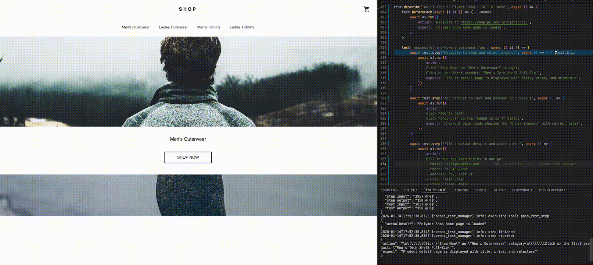

# **_checkmate_**

AI test automation that actually works. Write tests in plain English, without locators, and with less code.


[](LICENSE)

##

```typescript
await ai.step({
	name: 'search for playwright',
	action: `
		Navigate to google.com
		Type 'playwright test automation' in the search bar
		Press Enter key`,
	expect: `
		Search results contain the playwright.dev link`,
})
```

##

✅ **Zero Locators** - Write tests in plain English  
✅ **Any Provider** - Gemini, Claude, Groq, GPT, xAI, or local models  
✅ **Web & Salesforce** - Basic support out of the box, including active tab/popup tracking  
✅ **Cost Optimized** - Built-in token management and budgeting  
✅ **Playwright Test** - Native reports, traces and debugging  
✅ **Fully Customizable** - Build your own [extensions](docs/EXTENSIONS.md) and tools



## Get Started in 5 Minutes

### Prerequisites

- Node.js [LTS](https://nodejs.org/en/download)
- OpenAI [API key](https://platform.openai.com/api-keys) or compatible provider [Groq](https://console.groq.com/keys) [Gemini](https://aistudio.google.com/app/api-keys) [xAI](https://x.ai/api) etc.

### 1. Install

```bash
npm install -D dotenv @playwright/test @xoxoai/checkmate
npx playwright install
```

### 2. Configure the provider key and the `checkmate*` options

_the key is the only thing that lives in `.env`:_

```bash
CHECKMATE_OPENAI_API_KEY=#your_api_key_here
```

_everything else is set in `playwright.config.ts`, per project and overridable per test:_

```ts
import { defineConfig } from '@playwright/test'
import type { CheckmateOptions } from '@xoxoai/checkmate/playwright'

export default defineConfig<CheckmateOptions>({
	use: {
		checkmateModel: 'openai/gpt-oss-20b',
		checkmateOpenaiBaseUrl: 'https://api.groq.com/openai/v1', // optional, for OpenAI-compatible providers
		checkmateTurnCap: 20,
	},
})
```

### 3. Scaffold Test Examples

```bash
npx checkmate create-examples
```

### 4. Run Tests

```bash
npm run test:web:example
```

### 5. View Report

```bash
npm run show:report
```

## Writing Tests

**_checkmate_** tests are written using natural language by specifying `action` and `expect`.

Add the `ai` fixture to a fixtures file the team already owns, so existing custom fixtures keep working:

```typescript
// fixtures.ts
import { mergeTests } from '@playwright/test'
import { checkmate } from '@xoxoai/checkmate/playwright'
import { test as baseTest } from './my-existing-fixtures'

export const test = mergeTests(baseTest, checkmate)
```

Then write steps:

```typescript
import { test } from './fixtures'

test.describe('multi-step : full AI mode', async () => {
	test('purchase flow', async ({ ai }) => {
		await ai.step({
			name: 'Open Shop',
			action: `
			Navigate to https://my-shop.com`,
			expect: `
			My Shop home page is loaded`,
		})

		await ai.step({
			name: 'Select product',
			action: `
			Click 'Shop Now' on 'Men's Outerwear' category
			Click on the first Shell product in the list`,
			expect: `
			Product detail with title and price.`,
		})

		await ai.step({
			name: 'Cart and checkout',
			action: `
			Click 'Add to Cart'
			Click 'Checkout' in the 'Added to cart' dialog`,
			expect: `
			Checkout with Order Summary and totals`,
		})
	})
})
```

That's it. No page objects, no selectors. No locators. Peace on Earth.

Every `ai.step` creates its own Playwright step, labelled `ai: <name>`, and attaches a
`checkmate-step.json` report carrying the assertion, the layer that produced it, the tool calls,
the turn count, and the cost. A failing step fails the test with that reason.

Tests are orchestrated by [playwright](https://playwright.dev/docs/test-configuration) [config](playwright.config.ts).

### API

Compose your own **_checkmate_** using [extensions](docs/EXTENSIONS.md):

```typescript
import { createRunner } from '@xoxoai/checkmate/core'
import { web } from '@xoxoai/checkmate/playwright'
import { notion, database, api } from 'my-custom-extensions'

const runner = createRunner({
	extensions: [web({ page }), notion(), database(), api()],
})

const report = await runner.run({
	action: 'Open the pricing page',
	expect: 'Pricing details are visible',
})

console.log(report.outcome, report.category, report.reason, report.usage.costUsd)
```

`createRunner()` is the Playwright-free entry point: it resolves a `StepReport` instead of
asserting, so it can be driven from a plain script. Inside a Playwright test, use `ai.step`,
which runs the same loop and turns the report into a test result.

### Entry Points:

`@xoxoai/checkmate/core`: compose runner, tools, and extensions.  
`@xoxoai/checkmate/playwright`: Web extension with the mergeable `checkmate` test object, a bundled `test`, and `expect`; browser tools operate on the active tab and automatically switch to tabs/popups opened by actions.  
`@xoxoai/checkmate/salesforce`: Salesforce extensions with the same `ai` fixture shape.

See [guide](docs/GUIDE.md#best-practices) for tips on writing effective tests.

## Costs

They depend on the model, provider, test complexity, and number of steps.

Estimates for [gpt-oss-20b hosted on groq.com](https://console.groq.com/docs/model/openai/gpt-oss-20b):

- Simple test (~5 steps): ~$0.001 - $0.01
- Complex test (~20 steps): ~$0.01 - $0.05
- Full E2E suite (~50 complex tests): ~$1.00 - $2.00

**_checkmate_** includes built-in token usage [monitoring](docs/GUIDE.md#cost-management).

See [guide](docs/GUIDE.md#cost-management) for cost control and monitoring options.

## Common Issues

**AI makes incorrect decisions**

- Provide precise descriptions in `action` and focused assertions in `expect`
- Reference specific element and roles, for example: text, label, button, list, etc.
- Break complex workflows into single-action steps and use a step-by-step approach

**Tests loop during step execution**

- `checkmateTemperature` defaults to `0`, so a rerun differs as little as the model allows — lower it further only for a specific reason; models that reject the value fall back to their own default
- Use a reasoning model if possible to improve accuracy
- Set `checkmateLogLevel: 'debug'` to inspect model/tool loop diagnostics, including tool calls and recent message summaries

**JavaScript dialogs do not behave as expected**

- JavaScript `alert`/`confirm`/`prompt` dialogs are dismissed by default.
- Tell the step to accept, dismiss, or fill the dialog when the flow requires it.

**High token costs**

- Enable [snapshot filtering](docs/GUIDE.md#using-snapshot-filtering-for-token-optimization) with `checkmateSnapshotFilter: true` to auto-filter elements
- Adjust reasoning effort: `checkmateReasoningEffort`
- Leave `checkmateScreenshots` off if visuals are not needed
- Use a cheaper model, lower-end models often perform well: `gpt-5.4-nano` or `gpt-oss-20b`
- Set `checkmateBudgetUsd` per project so a runaway step is stopped rather than paid for

See [guide](docs/GUIDE.md#ai-options) for detailed configuration options and tips.

## FAQ

**Which models work best?**  
You can use any model that was trained for tool use.

Here are the best picks based on extensive testing:

- Highly recommended: [`gpt-oss-20b` hosted on groq.com](https://console.groq.com/docs/model/openai/gpt-oss-20b). Groq's infrastructure is optimized for minimal latency and fast inference, making it ideal for E2E test automation.
- Google's `gemini-2.5-flash` offers an excellent balance of cost and performance if you prefer major cloud providers.
- OpenAI's `gpt-5-mini`, `gpt-5.4-nano` and xAI's `grok-4-1-fast-reasoning` also work well and keep costs relatively low.

**Can I use local models?**  
Yes - **_checkmate_** works with any OpenAI‑compatible API, including local models via LM Studio, Ollama, or llama.cpp. I recommend [qwen3.5-4b](https://huggingface.co/Qwen/Qwen3.5-4B). It is fast (≈100 tokens/sec on an RTX 3060 Ti; ≈40 tokens/sec on Apple M3) and performs surprisingly well for E2E testing.

**Does it work with CI/CD?**  
Absolutely. Use **_checkmate_** as part of your existing [Playwright Test suites in any CI/CD pipeline](https://playwright.dev/docs/best-practices#run-tests-on-ci). You can mix AI‑driven steps and traditional tests as needed.

**Is this production-ready?**  
It depends. If you can accept some non‑deterministic behavior and leverage LLMs' randomness to help address the [pesticide paradox](https://medium.com/@suwekasansiluni/the-pesticide-paradox-what-farming-teaches-us-about-software-testing-ab5d625d4de1), **_checkmate_** can be production-ready. In many cases, the maintenance savings, faster development, and benefits of non‑linear execution outweigh occasional hiccups.

If you require 100% deterministic tests at all times, traditional Playwright remains the better choice.

**Best part?**  
You can mix both approaches within the same test suite, combining AI‑driven and traditional tests as needed:

```typescript
// traditional playwright actions:
await page.goto('https://www.google.com')
const searchBox = page.getByRole('combobox', { name: 'Search', exact: true })
await searchBox.fill('playwright test automation')
await searchBox.press('Enter')

// ai-driven actions and assertions:
await ai.step({
	action: 'Click on the link that leads to playwright.dev',
	expect: 'The playwright.dev homepage is displayed',
})
```

## Documentation

- [**_checkmate_** guide](docs/GUIDE.md)
- [**_checkmate_** extensions](docs/EXTENSIONS.md)
- [**playwright** official website](https://playwright.dev/)

## Contributing

I'd love your help! Key areas:

- Additional tool integrations (API testing, Salesforce, etc.)
- Further cost optimization techniques
- Context and prompt engineering improvements
- Error handling and recovery

See [roadmap](docs/ROADMAP.md) for future plans and development

## License

MIT [license](LICENSE)

## Why I build this?

Test automation shouldn't require a PhD in XPath. This project explores how AI can make it accessible to anyone.

Less coding, more testing.

Built with ❤️ by [Dawid Dobrowolski](https://github.com/dawiddiwad)
