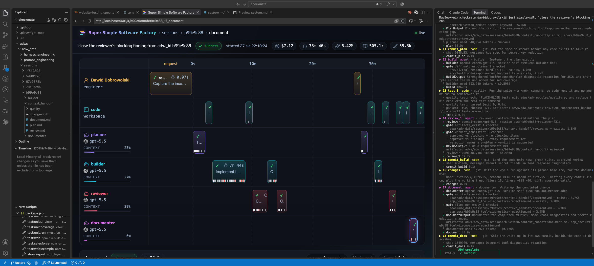
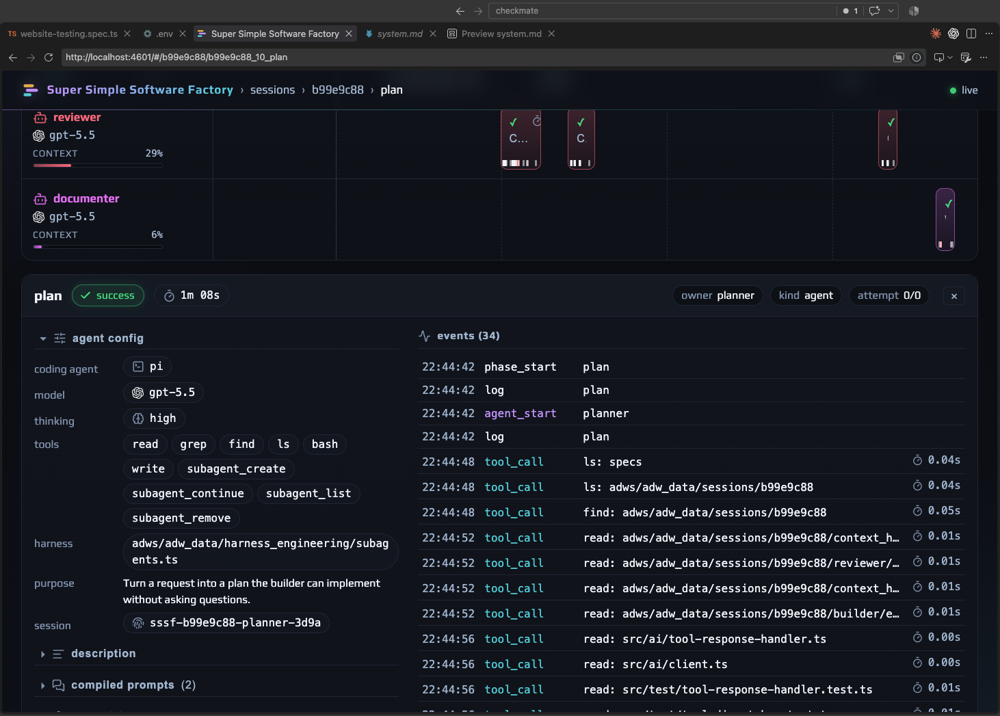
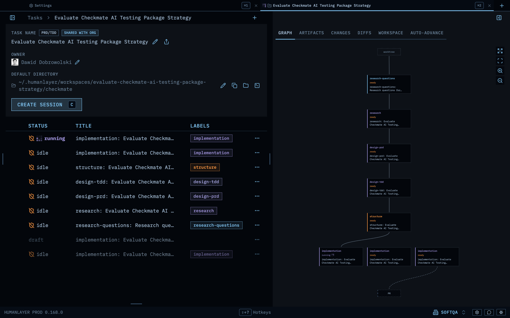
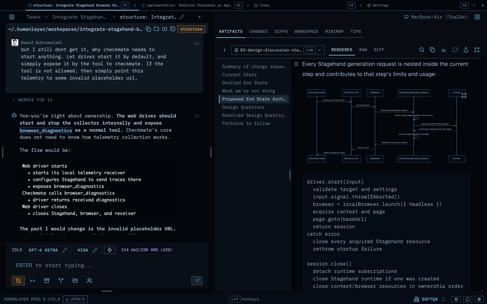

# Developing Checkmate

The optional **super simple software factory** and **HumanLayer** tools help agent workflows and keep tasks in separate worktrees.
Neither is needed to use the published package.

## Run the checks

```bash
npm run phase:verify           # full local check
npm run phase:verify -- --live # also run live Ollama acceptance
```

The local check covers types, lint, formatting, tests, a clean build, package contents,
installed exports, and CLI behavior.

For live checks, set `OPENAI_API_KEY`, `OPENAI_BASE_URL`, and `OPENAI_MODEL` in the
repo-root `.env`. Missing values fail the check; secrets are never printed.
CI runs the live gate on **Linux and macOS**. Release checks need both; Windows is unsupported in v1.

<summary>Checking a specific package</summary>

```bash
npm run test:package:final -- <candidate.tgz> --live
```

This checks installed exports, CLI behavior, and live Ollama acceptance against the same
tarball. The full `phase:verify -- --live` gate also checks its contents and build lifecycle.
For a standalone live run, `npm run test:e2e:ollama` builds its own candidate.

## sssf: run an agent workflow

[Super Simple Software Factory](../.claude/skills/sssf) runs agents through steps such as
planning, coding, testing, and review. Each run is recorded so you can follow its progress.

You'll need [`uv`](https://docs.astral.sh/uv/), [`just`](https://github.com/casey/just), and
`sqlite3`. The visualizer also needs [`bun`](https://bun.sh/).

```bash
just demo              # try two read-only runs
just prompt "..."      # one agent, one prompt
just scout "..."       # explore without editing
just plan "..."        # plan only
just plan-build "..."  # plan, build, commit
just sdlc "..."        # plan, build, test, commit
just simple-sdlc "..." # plan, build, test, review, document
```

Run `just` to list all recipes.

### Follow a run

```bash
just sessions         # last 10 runs
just phases <adw_id>  # status of each phase
just tail <adw_id>    # recent events
just procs <adw_id>   # active processes
just obs              # visualizer at http://localhost:4601
```

<summary>Preview</summary>



### Customize a workflow

- **Agents, models, and permissions:** [`sssf.config.yaml`](../adws/adw_sssf_config/sssf.config.yaml).
- **Workflow steps:** `adws/adw_*.py`; each script lists its phases at the top.
- **Prompts:** `adws/adw_data/`.

To use another roster for one run:

```bash
SSSF_CONFIG=other.yaml just sdlc "..."
```

For new workflows or deeper changes, ask your coding agent to use the `sssf` skill.
See its [cookbooks](../.claude/skills/sssf/cookbooks) for details.

## HumanLayer: give each task its own workspace

[HumanLayer](https://humanlayer.dev) supports CRISPY, RPI, PRD, and freeform workflows.
When you start a task, the [workspace config](../.humanlayer/workspace.json):

1. Creates a separate git worktree and branch for the task.
2. Runs `npm install`.
3. Copies local environment and agent settings into the worktree, without committing them.

This lets you work on several tasks without their edits colliding. Change the paths,
setup command, or copied files in the config above.

<summary>Preview</summary>


