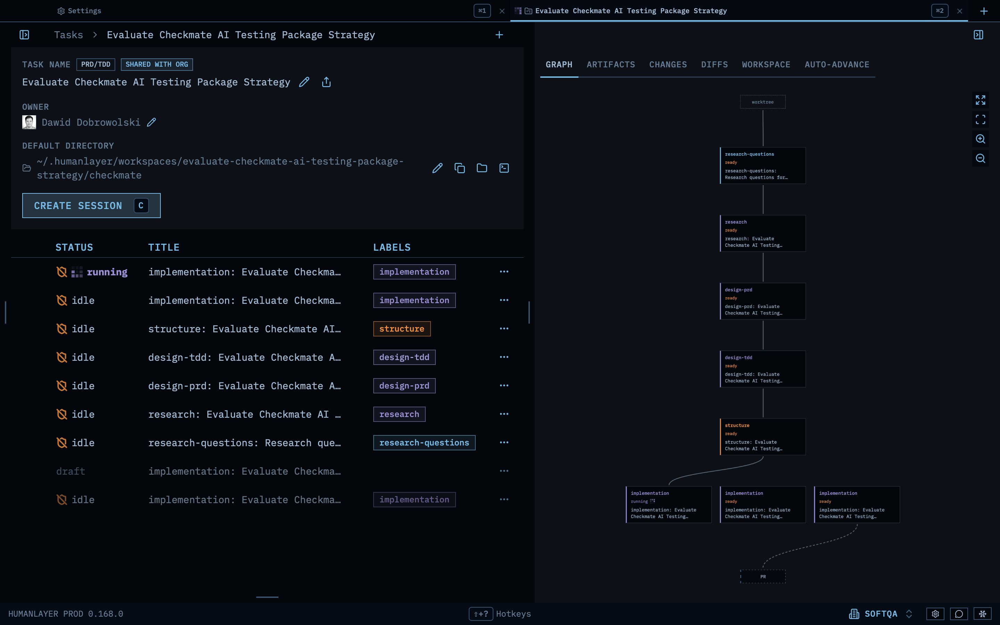
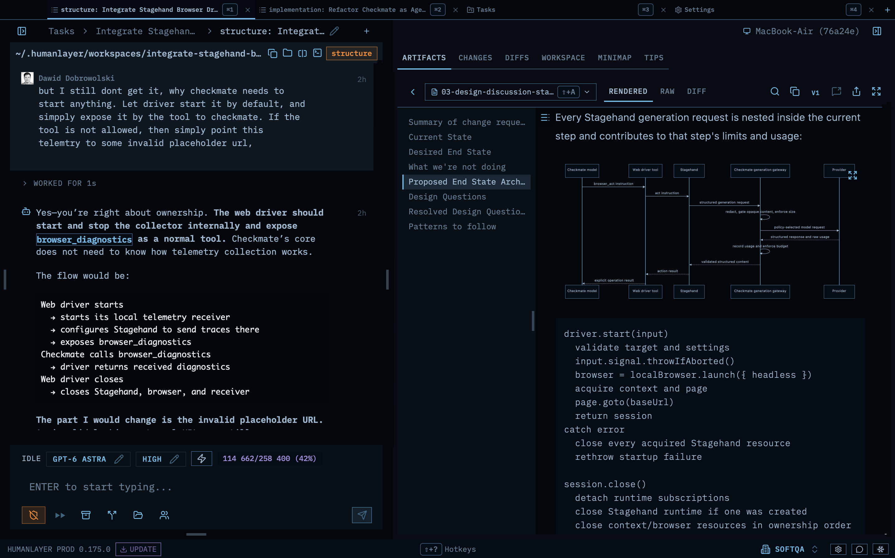

# Dev Guide

## CI and npm releases

The [CI workflow](../.github/workflows/ci.yml) verifies pull requests on Ubuntu and macOS with
`npm run phase:verify -- --live`. Set `OPENAI_API_KEY`, `OPENAI_BASE_URL`, and `OPENAI_MODEL` in both GitHub Actions secrets
and Dependabot secrets so dependency updates run the same live acceptance checks.

The CI `publish` job runs whenever a pull request is merged into the default branch, including Dependabot PRs, or when
CI is dispatched manually on that branch. Closing an unmerged PR does not publish. Dependabot's configuration and the
existing PR verification matrix remain unchanged. The publish job uses `pull_request_target` only for the merged PR's
`closed` event and checks out the default branch; it never checks out an unmerged PR head. PR merges remain a maintainer
action subject to the repository's merge requirements.

After the merge, CI checks out the latest default branch, increments the package patch version, runs `npm install`
to synchronize the lockfile, and reruns the full package and live acceptance verification. It commits both manifests,
pushes the version commit and `v<version>` tag atomically, then publishes the public npm package. For example, `0.6.1`
becomes `0.6.2`. The package version in the working branch stays unchanged until a release runs.

Before enabling releases:

1. Configure an [npm trusted publisher](https://docs.npmjs.com/trusted-publishers/) for `@xoxoai/checkmate` with GitHub owner
   `dawiddiwad`, repository `checkmate`, workflow filename `ci.yml`, and permission to publish. Leave the environment
   field empty. The workflow uses GitHub-hosted runners and a current Node.js/npm release for OIDC authentication; no npm
   token is needed.
2. Allow Actions write access to repository contents. The publish job requests `contents: write` and `id-token: write`
   explicitly; the PR verification job has read-only access.
3. If you enable branch protections or rulesets, permit the release identity to push version commits and tags.

To publish ad hoc, select **Actions → CI → Run workflow** on the default branch. Each new manual run publishes a
patch release; runs from other branches are skipped. Automatic and manual releases share a queue and run one at a time.

If a release fails, rerun that existing publishing run. A `Release-Source` commit trailer identifies its version commit,
so retries reuse that version and skip publishing if it already exists on npm. A registry outage fails the job rather
than being treated as an unpublished version. If the next patch already exists on npm without this release's commit, synchronize the repository version before
retrying. If a concurrent push prevents the version commit from reaching the default branch, rerun to prepare a patch
from its latest state. New manual runs always represent new releases, rather than retries.

## [HumanLayer](https://humanlayer.dev) gives each task its own agentic workspace

It supports CRISPY, RPI, PRD, and freeform workflows where humans and agents follow a structured, interactive, and guided process.

When you start a task, the [workspace config](../.humanlayer/workspace.json):

1. Creates a separate git worktree and branch for the task.
2. Runs `npm install`.
3. Copies local environment and agent settings into the worktree, without committing them.

This lets you work on several tasks without their edits colliding. Change the paths,
setup command, or copied files in the config above.

Preview

## Wiki

- [Architecture](../.agents/wiki/architecture.md)
- [Standards](../.agents/wiki/coding-standards.md)
- [Procedures](../.agents/wiki/development-procedures.md)
